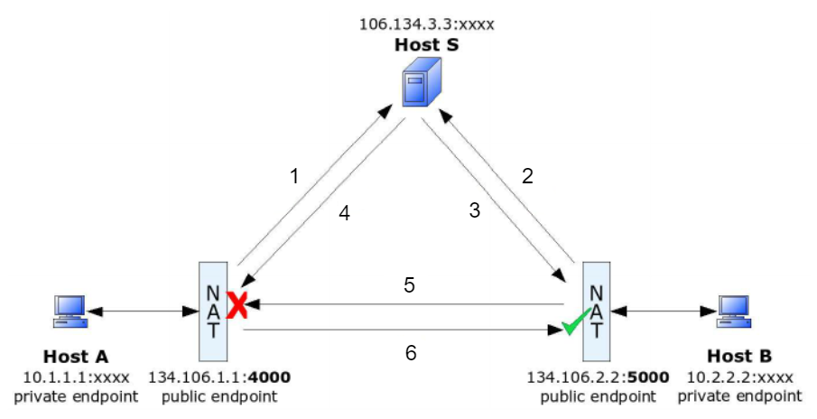

# Concepts

This file explains the basics of whole punching for each supported protocol and why it's needed in the first place.
The principles will be explained looking at UDP hole punching 
and expanded for the other protocols.

## Why Hole Punching is necessary

Devices in local networks access the Internet through a single public IP address which requires network address translation (NAT). 
This makes it inconvenient to directly connect to another device in another local network since 
ports must be manually opened in order for the two devices to communicate.  
Hole punching makes use of how most NAT devices operate in order to establish connections without 
the need for the user to configure their routers (where the NAT is typically located) or manually enable
insecure technologies like Universal Plug and Play (UPnP). 

## UDP Hole Punching

UDP hole punching is representative of the other protocols since it is one of the simplest 
and other protocols (like TCP) build on the very same concepts.

Hole punching can only work because NAT devices (except for symmetric NATs) reuse the 
same internal to external endpoint mapping for different destination addresses i.e. 
`datagram(iIP:iPort -> remoteIP1:remotePort1)` and `datagram(iIP:iPort -> remoteIP2:remotePort2)` 
will get the same `eIP:ePort` endpoint assigned by the NAT. 

The following image describes the basic steps that need to be performed in order to 'punch holes'.

1) Host A in local network A sends a UDP datagram to the rendezvous server S. 
During this process A's (private) endpoint is translated to a public endpoint by NAT A.
S now has A's public endpoint registered and waits for another client.
2) Host B does the same as A. S now also has B's public endpoint.
3) S sends A's public endpoint to B.
4) S sends B's public endpoint to A.
5) B attempts to connect to A by sending a UDP datagram to A's public endpoint. 
What NAT A does with B's datagram depends on the settings or implementation of the NAT. 
For a full-cone NAT, NAT A relays B's datagram to Host A and the connection is established.
For a restricted cone NAT, the packet is dropped due to no entry in translation table (this behavior is depicted in the image).
Either way, NAT B has now registered B sending packets to A's endpoint in its translation table.
6) When Host A now sends a datagram to B's public endpoint the datagram will pass through NAT B to Host B (if NAT B is not symmetric). 
Connection is now established since any subsequent packets from either side will have the required translation table entries
in the respective NAT devices. 

Hole punching will always work for full-cone and restricted cone NAT's as described above.   
For symmetric NATs, this procedure won't work. However, the hosts might try to guess
nearby ports since some symmetric NATs simply increment port numbers. If the port number is 
guessed correctly, connection will be established. 
If the NATs use port randomization, however, it is almost impossible to guess the right port 
and connection cannot be established. 

Further reading / examples on UDP hole punching can be found [here](https://en.wikipedia.org/wiki/UDP_hole_punching) 
and on NAT types [here](https://en.wikipedia.org/wiki/Network_address_translation#Methods_of_translation)

