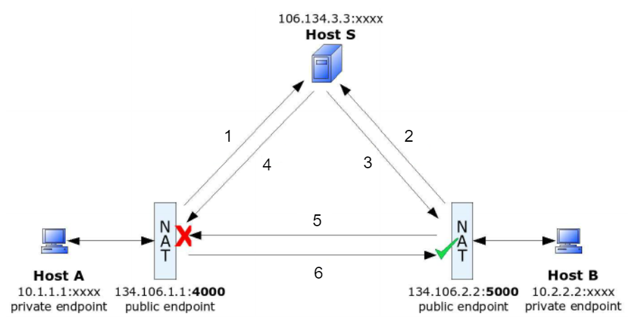

# Concept Example

This example implements a simple peer-to-peer chat 
which utilizes the basic concept of
UDP hole punching exactly as described in
[the concept document](../../../docs/README.md).  
<details>
  <summary>See the visualization here.</summary>

  

</details>

  
## Usage

### Client 

The well known rendezvous server can be optionally
specified with the first command line argument. 
```
client [rendezvous] 
```
or 
```
go run ./client [rendezvous] 
```
where rendezvous := `(<IP>|<FQDN>)?:<port>`. 
It defaults to rendezvous = `localhost:5001`. 

### Server

The listening address may be optionally set as first command line argument. 
```
server [laddr] 
```
or 
```
go run ./server [laddr] 
```
where laddr := `<rendezvous>`. 
It defaults to laddr = `:5001`.

When the server is started via `./server/docker-compose.yml` (or the Dockerfile) 
and any other laddr than the default is desired, the Dockerfile as well as the docker-compose 
have to be adjusted accordingly (entry point, port mapping). 
